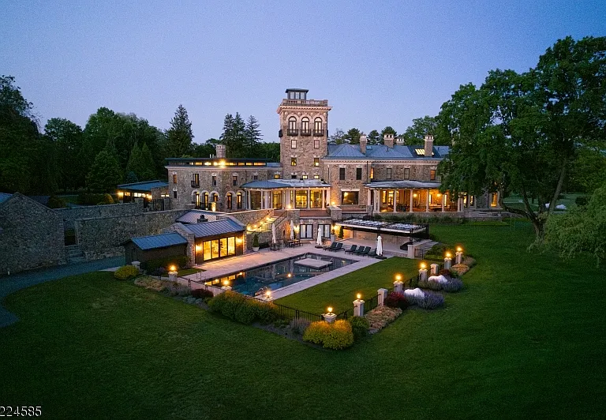

# Intro to OSINT

> Anthony DiTaranto | 11/13/2024

## Description

A famous person is selling their house. In this market, who wouldn't? Can you tell me who owns this house, and what the license plate of their "tough" car is? Flag format: udctf{FirstLast_licenseplate}

## twitterpost.JPG

## Solution

So we are told that a famous person is selling the house in the image, and the flag contains the owner's first and last name along with a license plate. My first step was to do a reverse lookup on the image, which I did [here](https://tineye.com/). I clicked on the first result and saw a listing for the house [here](https://www.xome.com/homes-for-sale/450-CLAREMONT-RD-Bernardsville-NJ-07924-381520356). From this information, we know that the address is 450 Claremont Rd, Bernardsville, NJ, 07924.

I searched `450 CLAREMONT RD Bernardsville, NJ 07924` on Google, and the second result was a Forbes article about the owner, Marc Ecko, who just listed his house for $13.7 million. Therefore, the first part of the flag is `markecko`.

When I searched for Marc Ecko's car, there were two results. The first was the "Gurkha," which is a heavy-duty armored vehicle. The second result was a pair of customized Nissan SUVs that did not have license plates. When trying to find the license plate for the "Gurkha," it was usually censored or not shown. I decided to look for a YouTube video, as it would be harder to censor the license plate, which I found [here](https://www.youtube.com/watch?v=0atDWlruHrE). The license plate `WLJ-80F`, which is the second part of the flag.

## Flag

`udctf{marcecko_WLJ80F}`