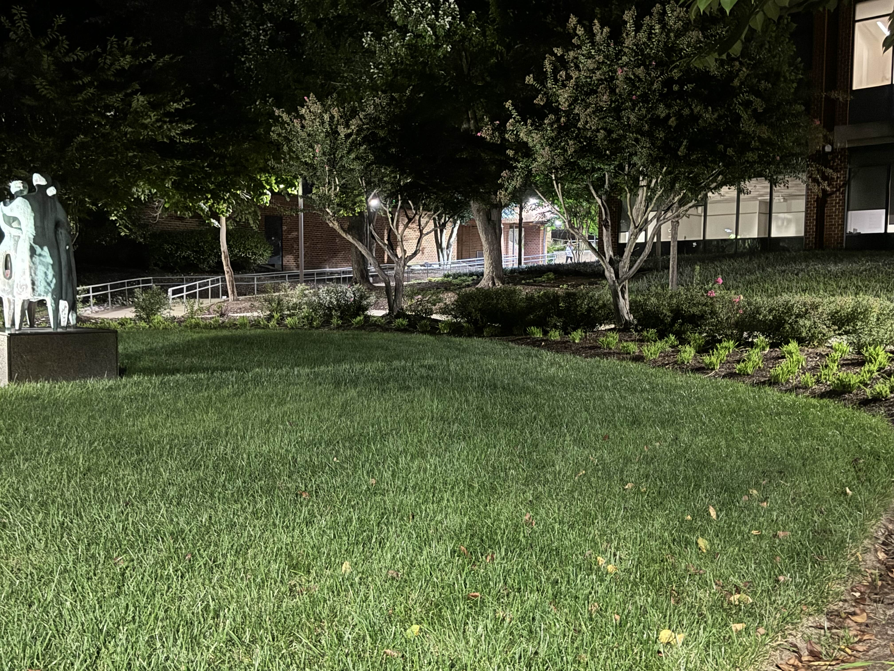

# Night School

> Anthony DiTaranto | 9/21/2024

## Description

It's said that a famous geocacher has left a cache on our Fairfax campus. He took this picture before disappearing into the night. Could you help us find where this picture was taken?

## nighttimestatue.jpg

## Solution

To solve this challenge, you need to wrap the name of the statue in the picture with pctf{}. The statue in question is on the left hand side of the picture and is 3 bronze figures with unique bodies.

After I googled `all the statues on GMU fairfax`, I mainly saw the statue of George Mason which doesn't match the statue in the image. I scrolled further down and eventually saw an image that resembled the statue I was looking for.

After clicking the image, I was brought to [the GMU website](https://www.gmu.edu/discover-mason). I scrolled down on the website and saw the statue I was looking for with the title "Communitas" under it which was the flag.

## Flag
`pctf{Communitas}`
