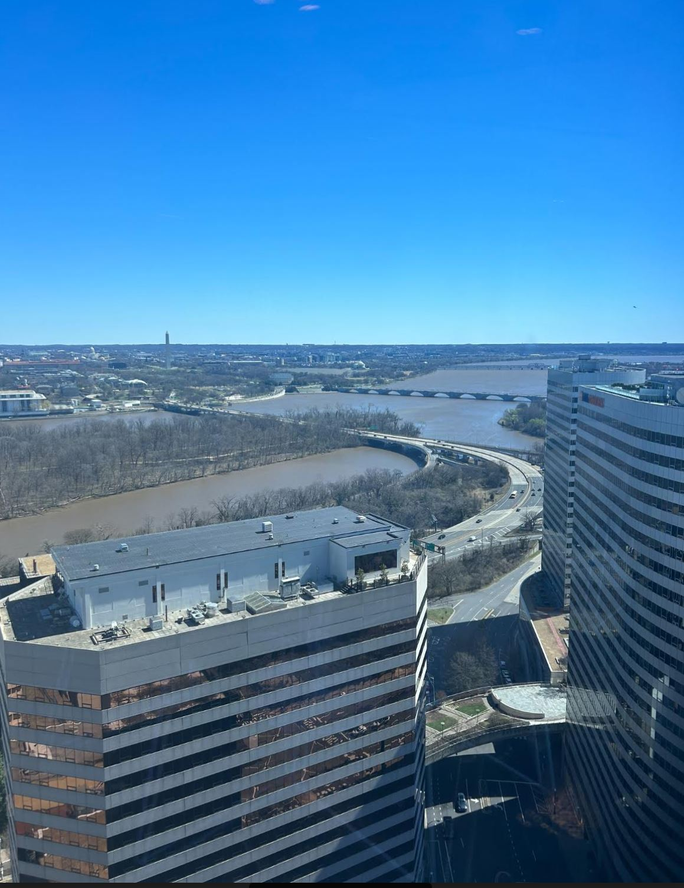
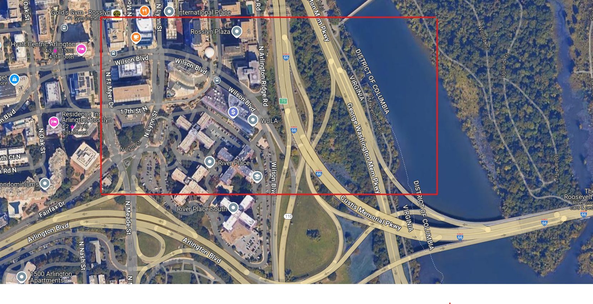
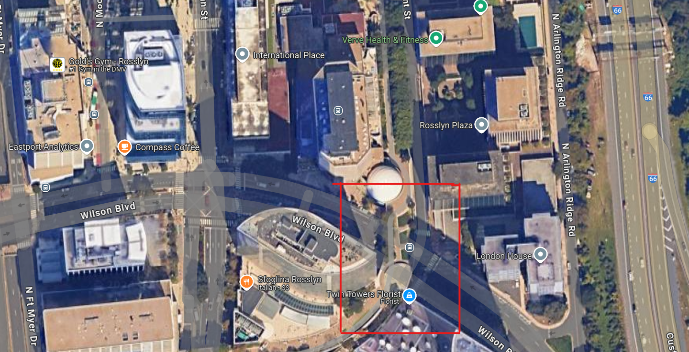
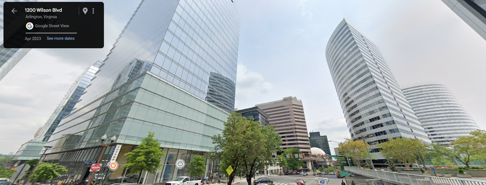

# On The Run

> Anthony DiTaranto | 9/20/2024

## Description

We've been tracking the adversary for weeks, and he just slipped up and posted this gorgeous high-rise view on his Twitter. His caption was "awesome meeting with a gorgeous view!" Can you track down his location?

## twitterpost.JPG

## Solution

The first thing I saw when analyzing the image was the two bridges, the river, and most importantly the Washington Monument. I Then went on google maps and matched the two bridges I saw to the Arlington Memorial Bridge and the Theodore Roosevelt Bridge. 

In the image, the Theodore Roosevelt Bridge curves towards the camera so I know the image was taken near where the bridge curves. I used four things to help identify the building, those being:

1. The building in the bottom left
2. The building on the right side
3. The picture was taken above the building in the bottom left
4. The walk way above the street

When coming off the bridge, it curves right and the street next to it curves the other direction. Therefore the building has to be somewhere in the square.

Next, I looked for the walk way above the street which is in red.

Therefore, The building we are looking for is near this point so I went into street view mode. In Street view, I was able to find the target building which is the tall building on the left. After getting near the building and going back to the map, I was able to get the name which is Convene

## Flag

`PCTF{Convene}`